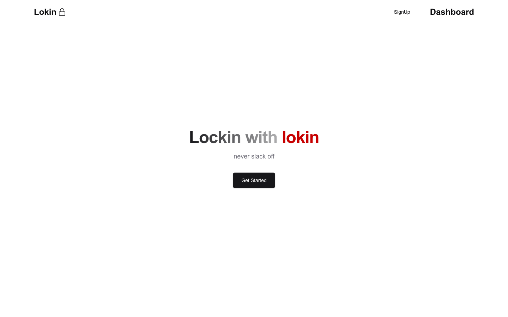

# 🔒 Lokin

Lokin is an innovative productivity website designed to help users stay focused and improve their work habits. With computer vision integration and a rewards system, Lokin ensures users remain committed to their tasks while offering a unique, gamified experience.

<br/>

## ⏰ Features

- **Timer with Webcam Monitoring**: Start a timer and keep your webcam active to ensure you stay on task until the timer ends.
- **Smartphone Detection**: If the user tries to use their smartphone, a buzzer sounds, and the timer automatically stops.
- **Reward Points System**: Earn points for each completed session and redeem them for coupons in the rewards section.
- **Computer Vision Technology**: Utilizes advanced computer vision algorithms to monitor user activity and ensure productivity.

<br/>

## 📸 Screenshots

### Landing Page
<br/>
<p align="center">
   
</p>


<br/>

## 🛠 Tech Stack

- **Frontend**: Next.js, TypeScript, Tailwind CSS
- **Backend**: Node.js
- **Computer Vision**: Python with OpenCV and related libraries
- **Database**: PostgreSQL
- **Hosting**: Vercel

<br/>

## 📝 How It Works

1. Log in to Lokin and start a new timer session.
2. The timer begins, and the webcam monitors your activity.
3. If smartphone usage is detected, a buzzer activates, and the timer stops.
4. Complete sessions to earn reward points.
5. Redeem points in the rewards section for coupons or other incentives.

<br/>

## 📦 Installation

### Prerequisites
- Node.js and npm installed on your system
- Python (for computer vision components)

### Steps
1. Clone the repository:
   ```bash
   git clone https://github.com/sreehhari/lokin.git
   ```
2. Navigate to the project directory:
   ```bash
   cd lokin
   ```
3. Install frontend dependencies:
   ```bash
   npm install
   ```
4. Install backend dependencies (if applicable):
   ```bash
   pip install -r requirements.txt
   ```
5. Start the development server:
   ```bash
   npm start
   ```
6. Open your browser and navigate to:
   ```
   http://localhost:3000
   ```

<br/>


## 📞 Support

For any issues or questions, feel free to reach out at: [support@lokin.com](mailto:support@lokin.com)

<br/>

## ✨ Show Your Support

If you like this project, please consider giving it a ⭐ on [GitHub](https://github.com/akash-abraham/lokin)!

<br/>

## 📄 License

This project is licensed under the MIT License. See the [LICENSE](LICENSE) file for details.

